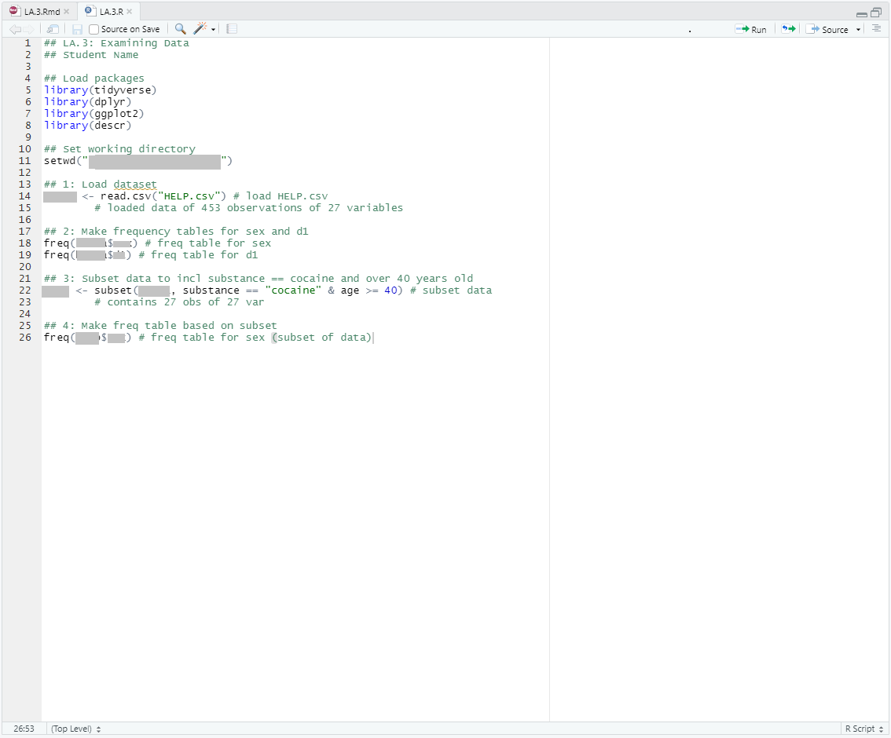
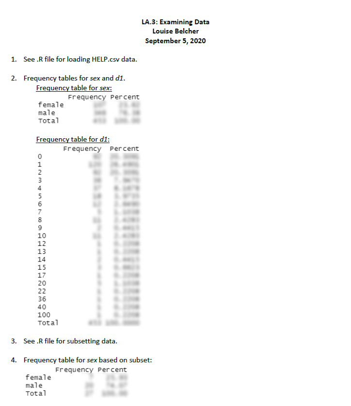

# Resources
- Before you begin,   

   -- make sure you have gone through the [R Help Guide](https://rpubs.com/yesun/Comm3710_helpwithR) and practiced it on your computer to understand the fundamental concepts and operations in R. 

   -- watch this [video](https://youtu.be/Dbj_l1PRIjA) on working with data in R. Keep this link at hand--you will likely have to watch the video and refer to it more than once throughout the assignment and course.

- Additional resources about R can be found on Canvas ("R Resources Module").

---

# Data
For this assignment, you will be working with the [Health Evaluation and Linkage to Primary Care (HELP) data set](https://yesuncomm.github.io/comm3710/files/HELP.csv). Submit your answers as a PDF document on Canvas.

The HELP study was a clinical trial for adult inpatients recruited from a detoxification unit. Patients with no primary care physician were randomized to receive a multidisciplinary assessment and a brief motivational intervention or usual care, with the goal of linking them to primary medical care.

The data set contains 453 observations on the following variables:  
(Highlighted are the variables that will be used in this assignment.)

* **`age`: Subject age (in years)** (measured at baseline)
* `anysub`: Use of any substance post-detox (a factor with levels no yes)
* `cesd`: Center for Epidemiologist Studies Depression measure at baseline (high scores indicate more depressive symptoms)
* **`d1`: lifetime number of hospitalizations for medical problems** (measured at baseline)
* `daysanysub`: time (in days) to first use of any substance post-detox
* `dayslink`: time (in days) to linkage to primary care
* `drugrisk`: Risk Assessment Battery drug risk scale at baseline
* `e2b`: number of times in past 6 months entered a detox program (measured at baseline)
* `female`: 0 for male, 1 for female
* **`sex`: a factor with levels male and female**
* `g1b`: experienced serious thoughts of suicide in last 30 days (measured at baseline; a factor with levels no yes)
* `homeless`: housing status: a factor with levels housed homeless
* `i1`: average number of drinks (standard units) consumed per day, in the past 30 days (measured at baseline)
* `i2`: maximum number of drinks (standard units) consumed per day, in the past 30 days (measured at baseline)
* `id`: subject identifier
* `indtot`: Inventory of Drug Use Consequences (InDUC) total score (measured at baseline)
* `linkstatus`: post-detox linkage to primary care (0 = no, 1 = yes)
* `link`: post-detox linkage to primary care: no yes
* `mcs`: SF-36 Mental Component Score (measured at baseline, lower scores indicate worse status)
* `pcs`: SF-36 Physical Component Score (measured at baseline, lower scores indicate worse status)
* `pss_fr`: perceived social support by friends (measured at baseline, higher scores indicate more support)
* `racegrp`: race/ethnicity: levels black hispanic other white
* `satreat`: any BSAS substance abuse treatment at baseline (no yes)
* `sexrisk`: Risk Assessment Battery sex risk score (measured at baseline)
* **`substance`: primary substance of abuse (alcohol cocaine heroin)**
* `treat`: randomized to HELP clinic (no yes)

---

# Instructions
1. Import the [HELP.csv data set](https://yesuncomm.github.io/comm3710/files/HELP.csv)<!--change link for each section--> into R. The data set can be also found on Canvas.
<details>
<summary>Hint</summary>

   The command to import (i.e., to read) a .csv data file into R and create an object named `helpdata` is:
   ```
   helpdata <- read.csv("HELP.csv")
   ```
   * Note that `helpdata` is the name of the object you assign to this data object in R. You can choose a different name for your preference (e.g., `data`, `data_help`, `dt`, etc.).
    
</details>

```{r message=FALSE, warning=FALSE, include=FALSE}
## Install packages
library(descr)
library(tidyverse)


## Load HELP dataset
hdata <- read.csv("HELP.csv")

```

<br>

2. Make a frequency table for `sex` and one for `d1`. Include these frequency tables in your submission and answer the questions below based on the relevant numbers in the frequency tables.
      a. How many patients in the study are female?
      b. How many patients in the study have never been hospitalized for medical problems?
      c. What percentage of patients in the study have been hospitalized fewer than 5 times?

   <details>
   <summary>Hint</summary>
   
      The package(s) and command(s) necessary to create frequency tables in R can be found in the video linked at the beginning of these instructions. Pay special attention to the `freq` command, which is part of the `descr` package. Make sure you have the package installed first.   
   </details>
<br>

3. Now, subset the data to only include patients **1) whose primary substance of abuse is cocaine** AND **2) who are at least 40 years old**.
<details>
<summary>Hint</summary>
   a. Often we are only interested in analyzing a subgroup of people included in a data set. For this question, we create a subset from the original data to keep only patients who meet the specified criteria. We can tell R to do so and save the subset as a new object. We can later answer questions directly related to the subset using the new object (e.g., Question #4 below)
   b. There are different ways to create a subset in R. One way is to use the command `subset`. The generic form of the `subset` command goes like this:   
   newdata `<- subset(`fulldata`,` term that specifies the conditions`)`
   c. To specify the conditions for Q3, we use  `substance == "cocaine" & age >= 40`. This argument says that both of these two conditions have to met to be included in the subset: 1) patients whose primary substance of abuse (the variable in the data set is `substance`) is `"cocaine"` (`==` as "equal to" in R); AND 2) whose age (variable: `age`) is `40` or older (`>=` in R). Also note that `"cocaine"` is in quotation marks since it's a category of a qualitative variable. `40` does not need "" around it as age is a numerical variable.The `&` sign specifies that only participants who meet both criteria will be in the subset.      
</details>
<br>

4. Make a frequency table for sex based on *the subset* created in Q3. Include this frequency table in your submission and answer the questions below.
      a. How many patients in the study are at least 40 years old and have cocaine listed as his/her primary abuse substance?
      b. What percentage of patients who are at least 40 years old and have cocaine listed as his/her primary abuse substance are male?

<br>

Submit the following on Canvas. Sample submissions are included below.  
   (a) A **.R file** containing the code used to complete this assignment. This document should include comments that explain your commands (see example submission).  
   (b) A **PDF file** containing the answers to each question--clearly label the answers with the question number.

---

# Sample Submission {.tabset .tabset-fade}

Note that the screenshots below do not contain the answers to LA.3. Your submission **should** contain answers to the questions in the assignment that are **clearly labeled**.

## Screenshot of .R file example


## Screenshot of PDF file example

